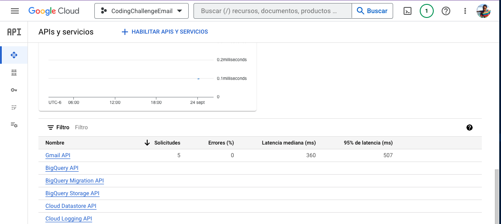

# Summary of PRs

Python script to parse the pull requests that a given repository has had in the past week by using the Github API.

The result can be either emailed using the Gmail API or printed to the console.

Only a summary of the PRs will be displayed, as the most relevant metadata identified were:

- Title
- State
- Date created
- URL
- is_draft

### Getting started

To run this program in the command line, provide as an argument the Personal access token from github as a string or env var to be able to use the github API

> export GITHUB_PAT=XXXXXXX

> python main.py $GITHUB_PAT

The token created should have the permissions to access public repositories: *public_repo* 

To be able to use the gmail API I followed the tutorial [here](https://developers.google.com/gmail/api/quickstart/python?hl=en) to use OAuth2 by creating a project on Google Cloud and creating API credentials with *gmail.send* permission.

It is possible to send emails via gmail without using Oauth and that would be to allow unsecure apps on your gmail account settings, which is risky if you're using your regular account.

### Demo

The output of this program can be displayed by printing on the console or by sending an email to a specified email destination.

Send email option

        if __name__ == "__main__":
            github_token = str(sys.argv[1])
            email_dest = 'danybecerr+testing@gmail.com'
            pr_summary_message = get_pr_summary(github_token)
            gmail_send_message(email_dest, pr_summary_message)

Print to the console option

        if __name__ == "__main__":
            github_token = str(sys.argv[1])
            pr_summary_message = get_pr_summary(github_token)
            print(pr_summary_message)

Email that is sent:

Console output:

Github view of the PRs on opentofu's repository: (the source for this script)

        

### Other useful steps

In order to use the gmail API python packages you need python 3.10 or later.

install python 3.10 with homebrew 
> brew install pyenv

create a virtual env with homebrew's installation
> /opt/homebrew/Cellar/python@3.10/3.10.13/bin/python3.10 -m venv py310

activate the venv
> source py310/bin/activate

### Screenshots of the OAuth2 screen when running the script for the first time

### screenshots of the google cloud settings

### Screenshot of the github PAT on my account

## References

1. [How to send email with Python. Google Developers](https://developers.google.com/gmail/api/guides/sending?hl=es-419#python)

2. [Available scopes for gmail API. Google Developers](https://developers.google.com/gmail/api/auth/scopes?hl=es-419)

3. [Creating python datetime instances. RealPython](https://realpython.com/python-datetime/#creating-python-datetime-instances)

4. [Python send email. RealPython](https://realpython.com/python-send-email/)

5. [Gmail API python quickstart. Google Developers](https://developers.google.com/gmail/api/quickstart/python?hl=en)

6. [Github List Pull Requests REST API. Github Docs](https://docs.github.com/en/rest/pulls/pulls?apiVersion=2022-11-28#list-pull-requests)

7. [OpenTofu's Github Pull Requests](https://github.com/opentofu/opentofu/pulls)

8. [Pagination in the REST API. Atlassian](https://developer.atlassian.com/server/confluence/pagination-in-the-rest-api/)

9. [Exception handling of python requests module. Tutorialspoint](https://www.tutorialspoint.com/exception-handling-of-python-requests-module)